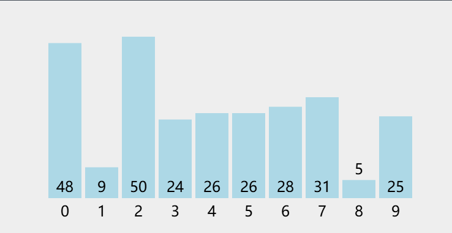
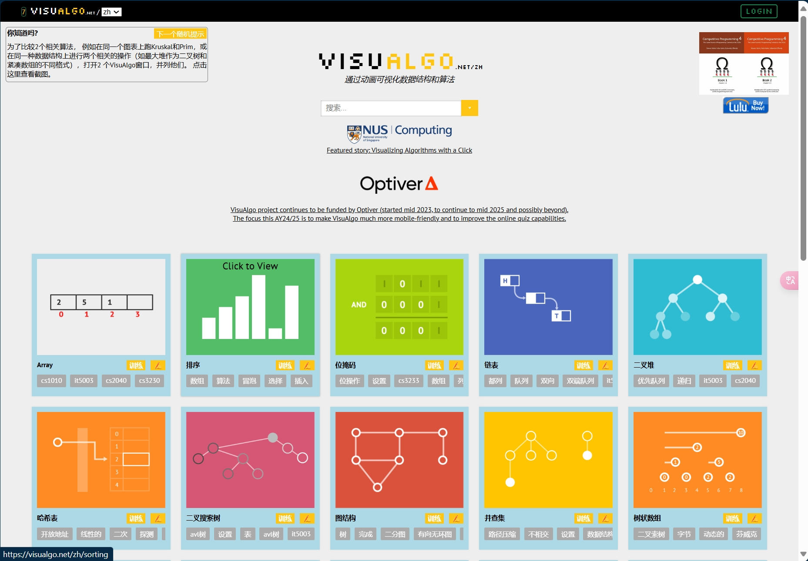
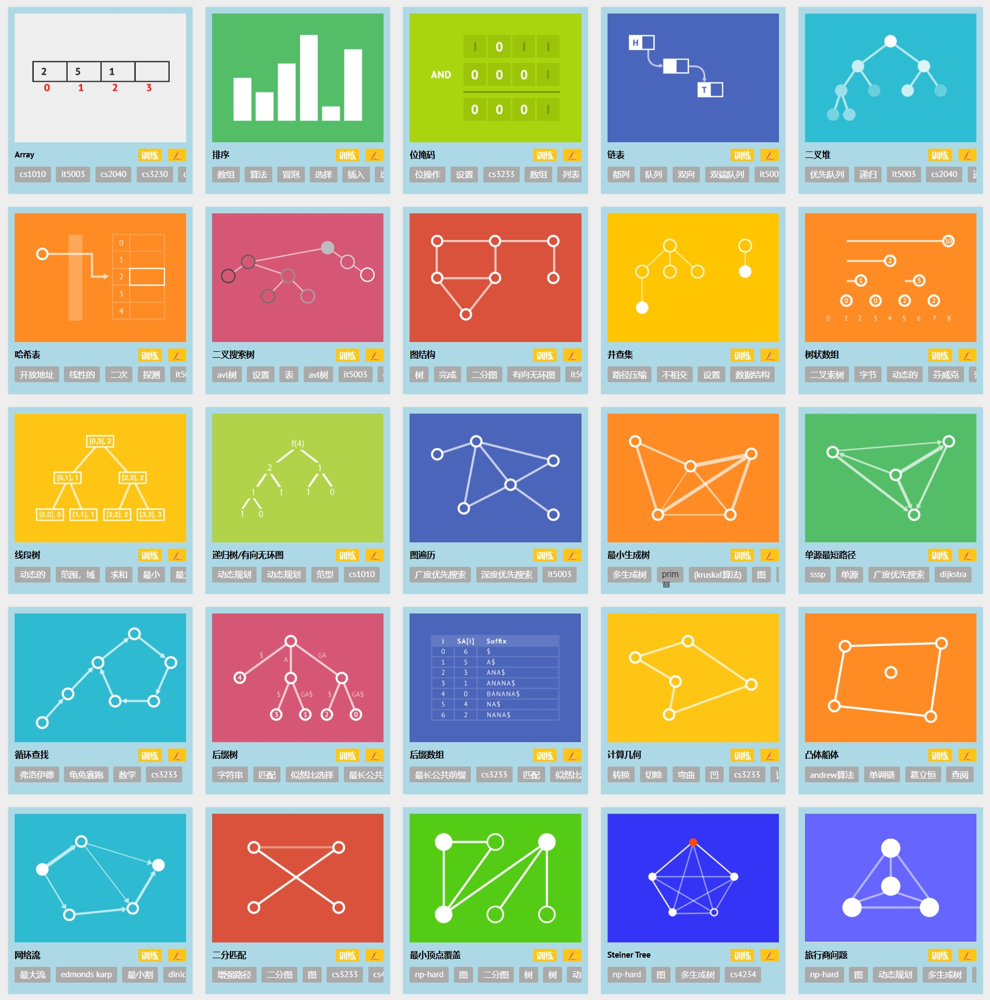

# 算法学习必备：算法可视化工具

一般来说中小学生不用专门买算法书，一方面因为没有针对这个年龄群体的合适的书；

另外一方面，有很多在线的教程、视频，配合『**算法可视化**』工具就很好了。

**算法可视化 Algorithm Visualization**，意思是：

> 用动态的、一步一步的、动画的方式，
> 
> 让你『**看得见**』算法的每一步的数据变化、数据结构的变化，
> 
> 以便更好的学习、理解算法的原理、逻辑和详细的过程。

## 一、推荐的算法可视化网站

下面几个免费的在线算法可视化网站非常不错：

1. ✅[visualgo.net](https://visualgo.net/zh) 原生支持中文

2. [Algorithm Visualizer](https://algorithm-visualizer.org/) 全英文 **开源项目**

3. [Data Structure Visualizations](https://www.cs.usfca.edu/~galles/visualization/Algorithms.html) 全英文

4. 国内新出的：[图码](https://www.totuma.cn/) ——收费，暂不推荐

还有几个算法相关的在线工具网站，就不一一列出了。

另外，神经网络领域最近两年也涌现出了很多类似的算法可视化网站，回头另行推荐。

## 二、关于 VisuAlgo.net 的补充介绍

**项目背景：**

- VisuAlgo 项目最初由新加坡国立大学（National University of Singapore, NUS）的副教授 Steven Halim 构思于2011年。

- 项目领导者和顾问是 Steven Halim，以及 Google 的高级软件工程师 Dr Felix Halim。

- 项目团队还包括多名本科生研究助理和参与最终年项目/UROP（Undergraduate Research Opportunities Program）的学生。

**与** **NUS 新加坡国立大学** **的关系**：

- VisuAlgo 最初是为 NUS 学生设计的，特别是那些注册了各种数据结构和算法课程的学生（例如，CS1010/等效课程，CS2040/等效课程（包括IT5003），CS3230，CS3233，和 CS4234）。

- NUS CDTL（Centre for Development and Technology Learning）提供了教学增强基金来启动这个项目。

- 项目中针对 NUS 的学生提供了在线测试和考试功能。

## 三、关注豆包与掘金合作的 AI刷题

另外，这几天（2024.11）试了一下 **字节跳动旗下** **豆包** 与 **稀土掘金** 合作的 [**AI 刷题**](https://juejin.cn/problemset)，

——感觉这个方向不错，值得关注，但暂时功能和细节还不够推荐。

